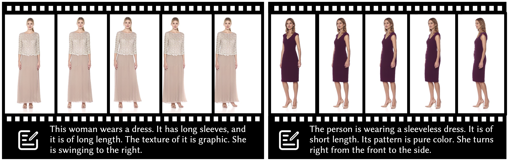

<div align="center">

<h1>Text2Performer: Text-Driven Human Video Generation</h1>

<div>
    <a href="https://yumingj.github.io/" target="_blank">Yuming Jiang</a><sup>1</sup>,
    <a href="https://williamyang1991.github.io/" target="_blank">Shuai Yang</a><sup>1</sup>,
    <a href="https://github.com/yumingj/Text2Performer">Tong Liang Koh</a><sup>1</sup>,
    <a href="https://wywu.github.io/" target="_blank">Wayne Wu</a><sup>2</sup>,
    <a href="https://www.mmlab-ntu.com/person/ccloy/" target="_blank">Chen Change Loy</a><sup>1</sup>,
    <a href="https://liuziwei7.github.io/" target="_blank">Ziwei Liu</a><sup>1</sup>
</div>
<div>
    <sup>1</sup>S-Lab, Nanyang Technological University&emsp; <sup>2</sup>Shanghai AI Laboratory
</div>

[Paper](https://arxiv.org/pdf/2304.08483.pdf) | [Project Page](https://yumingj.github.io/projects/Text2Performer.html) | [Dataset](https://github.com/yumingj/Fashion-Text2Video) | [Video](https://youtu.be/YwhaJUk_qo0)
</br>

<strong>Text2Performer synthesizes human videos by taking the text descriptions as the only input.</strong>

<div style="width: 100%; text-align: center; margin:auto;">
    
</div>

:open_book: For more visual results, go checkout our <a href="https://yumingj.github.io/projects/Text2Performer.html" target="_blank">project page</a>

</div>

## Installation
**Clone this repo:**
```bash
git clone https://github.com/yumingj/Text2Performer.git
cd Text2Performer
```

**Dependencies:**

```bash
conda env create -f env.yaml
conda activate text2performer
```

## (1) Dataset Preparation

In this work, we contribute a human video dataset with rich label and text annotations named [Fashion-Text2Video](https://github.com/yumingj/Fashion-Text2Video) Dataset.

You can download our processed dataset from this [Google Drive](https://drive.google.com/drive/folders/1NFd_irnw8kgNcu5KfWhRA8RZPdBK5p1I?usp=sharing).
After downloading the dataset, unzip the file and put them under the dataset folder with the following structure:
```
./datasets
├── FashionDataset_frames_crop
    ├── xxxxxx
        ├── 000.png
        ├── 001.png
        ├── ...
    ├── xxxxxx
    └── xxxxxx
├── train_frame_num.txt
├── val_frame_num.txt
├── test_frame_num.txt
├── moving_frames.npy
├── captions_app.json
├── caption_motion_template.json
├── action_label
    ├── xxxxxx.txt
    ├── xxxxxx.txt
    ├── ...
    └── xxxxxx.txt
└── shhq_dataset % optional
```

## (2) Sampling

### Pretrained Models

Pretrained models can be downloaded from the [Google Drive](https://drive.google.com/drive/folders/1Dgg0EaldNfyPhykHw1TYrm4qme3CqrDz?usp=sharing). Unzip the file and put them under the pretrained_models folder with the following structure:
```
pretrained_models
├── sampler_high_res.pth
├── video_trans_high_res.pth
└── vqgan_decomposed_high_res.pth
```

After downloading pretrained models, you can use ```generate_long_video.ipynb``` to generate videos.

## (3) Training Text2Performer
### Stage I: Decomposed VQGAN
Train the decomposed VQGAN. If you want to skip the training of this network, you can download our pretrained model from [here](https://drive.google.com/file/d/1G59bRoOUEQA8xljRDsfyiw6g8spV3Y7_/view?usp=sharing).

For better performance, we also use the data from [SHHQ dataset](https://github.com/stylegan-human/StyleGAN-Human/blob/main/docs/Dataset.md) to train this stage.
```python
python -m torch.distributed.launch --nproc_per_node=4 --master_port=29596 train_vqvae_iter_dist.py -opt ./configs/vqgan/vqgan_decompose_high_res.yml --launcher pytorch
```

### Stage II: Video Transformer
Train the video transformer. If you want to skip the training of this network, you can download our pretrained model from [here](https://drive.google.com/file/d/1QRQlhl8z4-BQfmUvHoVrJnSpxQaKDPZH/view?usp=sharing).
```python
python -m torch.distributed.launch --nproc_per_node=4 --master_port=29596 train_dist.py -opt ./configs/video_transformer/video_trans_high_res.yml --launcher pytorch
```

### Stage III: Appearance Transformer
Train the appearance transformer. If you want to skip the training of this network, you can download our pretrained model from [here](https://drive.google.com/file/d/19nYQT511XsBzq1sMUc2MmfpDKT7HVi8Z/view?usp=sharing).
```python
python train_sampler.py -opt ./configs/sampler/sampler_high_res.yml
```

## Citation

If you find this work useful for your research, please consider citing our paper:

```bibtex
@inproceedings{jiang2023text2performer,
  title={Text2Performer: Text-Driven Human Video Generation},
  author={Jiang, Yuming and Yang, Shuai and Koh, Tong Liang and Wu, Wayne and Loy, Chen Change and Liu, Ziwei},
  booktitle={Proceedings of the IEEE/CVF International Conference on Computer Vision},
  year={2023}
}
```

## :newspaper_roll: License

Distributed under the S-Lab License. See `LICENSE` for more information.


